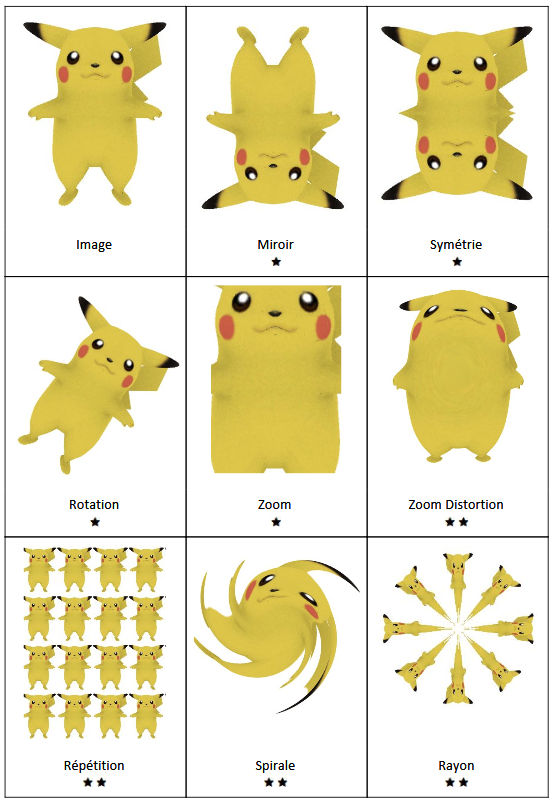
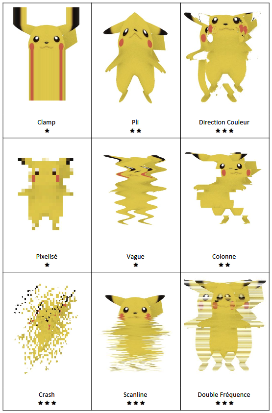
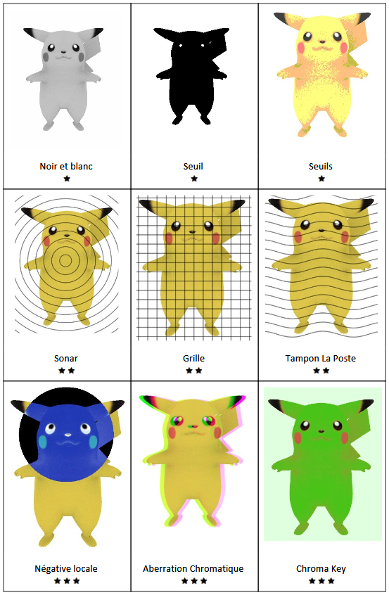
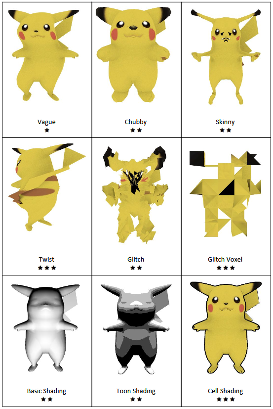
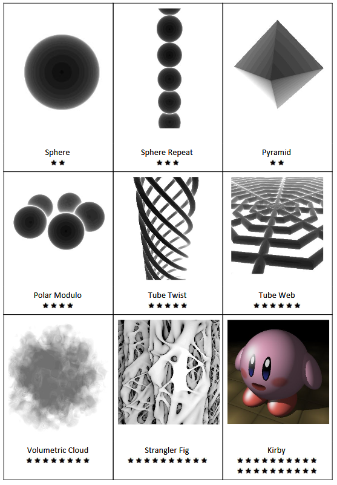

# Shader Exam

#### Page 1 - 2D Filters

|   |<a href="https://github.com/leon196/SIGExam/blob/77033dfe1afae9c99796c6a41609617a894ca253/Assets/shaders/filter.shader#L30">Miroir</a>|<a href="https://github.com/leon196/SIGExam/blob/77033dfe1afae9c99796c6a41609617a894ca253/Assets/shaders/filter.shader#L35">Symétrie</a>|
|---|---|---|
|<a href="https://github.com/leon196/SIGExam/blob/77033dfe1afae9c99796c6a41609617a894ca253/Assets/shaders/filter.shader#L40">Rotation</a>|<a href="https://github.com/leon196/SIGExam/blob/77033dfe1afae9c99796c6a41609617a894ca253/Assets/shaders/filter.shader#L51">Zoom</a>|<a href="https://github.com/leon196/SIGExam/blob/77033dfe1afae9c99796c6a41609617a894ca253/Assets/shaders/filter.shader#L58">Zoom Distortion</a>|
|<a href="https://github.com/leon196/SIGExam/blob/77033dfe1afae9c99796c6a41609617a894ca253/Assets/shaders/filter.shader#L66">Répétition</a>|<a href="https://github.com/leon196/SIGExam/blob/77033dfe1afae9c99796c6a41609617a894ca253/Assets/shaders/filter.shader#L75">Spirale</a>|<a href="https://github.com/leon196/SIGExam/blob/77033dfe1afae9c99796c6a41609617a894ca253/Assets/shaders/filter.shader#L86">Rayon</a>|

#### Page 2 - 2D Filters  

|<a href="https://github.com/leon196/SIGExam/blob/77033dfe1afae9c99796c6a41609617a894ca253/Assets/shaders/filter.shader#L98">Clamp</a>|<a href="https://github.com/leon196/SIGExam/blob/77033dfe1afae9c99796c6a41609617a894ca253/Assets/shaders/filter.shader#L121">Pli</a>|<a href="https://github.com/leon196/SIGExam/blob/77033dfe1afae9c99796c6a41609617a894ca253/Assets/shaders/filter.shader#L145">Direction Couleur</a>|
|---|---|---|
|<a href="https://github.com/leon196/SIGExam/blob/77033dfe1afae9c99796c6a41609617a894ca253/Assets/shaders/filter.shader#L111">Pixelisé</a>|<a href="https://github.com/leon196/SIGExam/blob/77033dfe1afae9c99796c6a41609617a894ca253/Assets/shaders/filter.shader#L116">Vague</a>|<a href="https://github.com/leon196/SIGExam/blob/77033dfe1afae9c99796c6a41609617a894ca253/Assets/shaders/filter.shader#L128">Colonne</a>|
|<a href="https://github.com/leon196/SIGExam/blob/77033dfe1afae9c99796c6a41609617a894ca253/Assets/shaders/filter.shader#L134">Crash</a>|<a href="https://github.com/leon196/SIGExam/blob/77033dfe1afae9c99796c6a41609617a894ca253/Assets/shaders/filter.shader#L140">Scanline</a>|<a href="https://github.com/leon196/SIGExam/blob/77033dfe1afae9c99796c6a41609617a894ca253/Assets/shaders/filter.shader#L103">Double Fréquence</a>  

#### Page 3 - 2D Filters  

|<a href="https://github.com/leon196/SIGExam/blob/77033dfe1afae9c99796c6a41609617a894ca253/Assets/shaders/filter.shader#L154">Noir et blanc</a>|<a href="https://github.com/leon196/SIGExam/blob/77033dfe1afae9c99796c6a41609617a894ca253/Assets/shaders/filter.shader#L158">Seuil</a>|<a href="https://github.com/leon196/SIGExam/blob/77033dfe1afae9c99796c6a41609617a894ca253/Assets/shaders/filter.shader#L163">Seuils</a>|
|---|---|---|
|<a href="https://github.com/leon196/SIGExam/blob/77033dfe1afae9c99796c6a41609617a894ca253/Assets/shaders/filter.shader#L169">Sonar</a>|<a href="https://github.com/leon196/SIGExam/blob/77033dfe1afae9c99796c6a41609617a894ca253/Assets/shaders/filter.shader#L176">Grille</a>|<a href="https://github.com/leon196/SIGExam/blob/77033dfe1afae9c99796c6a41609617a894ca253/Assets/shaders/filter.shader#L183">Tampon La Poste</a>|
|<a href="https://github.com/leon196/SIGExam/blob/77033dfe1afae9c99796c6a41609617a894ca253/Assets/shaders/filter.shader#L189">Négative Locale</a>|<a href="https://github.com/leon196/SIGExam/blob/77033dfe1afae9c99796c6a41609617a894ca253/Assets/shaders/filter.shader#L197">Aberration Chromatique</a>|<a href="https://github.com/leon196/SIGExam/blob/77033dfe1afae9c99796c6a41609617a894ca253/Assets/shaders/filter.shader#L211">Chroma Key</a>  

#### Page 4 - 3D effects  

|<a href="https://github.com/leon196/SIGExam/blob/77033dfe1afae9c99796c6a41609617a894ca253/Assets/shaders/vertex.shader#L41">Vague</a>|<a href="https://github.com/leon196/SIGExam/blob/77033dfe1afae9c99796c6a41609617a894ca253/Assets/shaders/vertex.shader#L46">Chubby</a>|<a href="https://github.com/leon196/SIGExam/blob/77033dfe1afae9c99796c6a41609617a894ca253/Assets/shaders/vertex.shader#L51">Skinny</a>|
|---|---|---|
|<a href="https://github.com/leon196/SIGExam/blob/77033dfe1afae9c99796c6a41609617a894ca253/Assets/shaders/vertex.shader#L56">Twist</a>|<a href="https://github.com/leon196/SIGExam/blob/77033dfe1afae9c99796c6a41609617a894ca253/Assets/shaders/vertex.shader#L63">Glitch</a>|<a href="https://github.com/leon196/SIGExam/blob/77033dfe1afae9c99796c6a41609617a894ca253/Assets/shaders/vertex.shader#L68">Glitch Voxel</a>|
|<a href="https://github.com/leon196/SIGExam/blob/77033dfe1afae9c99796c6a41609617a894ca253/Assets/shaders/vertex.shader#L98">Basic Shading</a>|<a href="https://github.com/leon196/SIGExam/blob/77033dfe1afae9c99796c6a41609617a894ca253/Assets/shaders/filter.shader#L104">Toon Shading</a>|<a href="https://github.com/leon196/SIGExam/blob/master/Assets/shaders/outline.shader">Cell Shading</a>  

#### Page 5 - Raymarching  

|<a href="https://github.com/leon196/SIGExam/blob/77033dfe1afae9c99796c6a41609617a894ca253/Assets/shaders/raymarching.shader#L74">Sphere</a>|<a href="https://github.com/leon196/SIGExam/blob/77033dfe1afae9c99796c6a41609617a894ca253/Assets/shaders/raymarching.shader#L78">Sphere Repeat</a>|<a href="https://github.com/leon196/SIGExam/blob/77033dfe1afae9c99796c6a41609617a894ca253/Assets/shaders/raymarching.shader#L33">Pyramid</a>|
|---|---|---|
|<a href="https://github.com/leon196/SIGExam/blob/77033dfe1afae9c99796c6a41609617a894ca253/Assets/shaders/raymarching.shader#L83">Polar Modulo</a>|<a href="https://github.com/leon196/SIGExam/blob/77033dfe1afae9c99796c6a41609617a894ca253/Assets/shaders/raymarching.shader#L89">Tube Twist</a>|<a href="https://github.com/leon196/SIGExam/blob/77033dfe1afae9c99796c6a41609617a894ca253/Assets/shaders/raymarching.shader#L96">Tube Web</a>|
|<a href="https://github.com/leon196/SIGExam/blob/77033dfe1afae9c99796c6a41609617a894ca253/Assets/shaders/raymarching.shader#L105">Cloud</a>|<a href="https://www.shadertoy.com/view/lssfWB">Strangler Fig</a>|<a href="https://www.shadertoy.com/view/lt2Bz3">Kirby</a>|  

